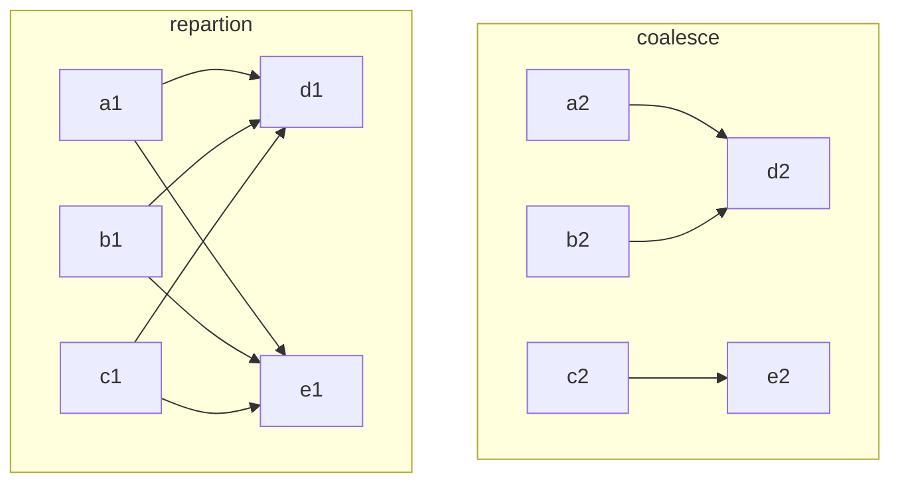

> 主要分析spark出现的fetch failed及retry的原因，对作业进行优化，降低运行时长和资源消耗，其中主要涉及的知识有 `Failed while starting block fetches异常`、`repartition` 和 `coalesce`算子、`Stage Retry`、`TaskCommitDenied异常`

## 问题背景

用户反馈作业application_1619512295487_1025286运行较慢，占用较多资源影响到后续任务的运行，任务为通过Ozzie提交的spark action，其中主要涉及到DF读取hdfs数据，通过一系列的sql运算后，写回到hdfs。

## 分析过程 

1. 整个作业分为两个job，job-0运行时间段、stage少、task少，**job-1运行时间长、task多、具有失败的stage和task，着重分析job-1**，job-1主要包括stage-1和stage-2。

   

2. stage-1和stage-2存在多次retry，且stage-2存在Failed Stage，整理执行顺序如下（页面展示的stage信息中时间不准）,**在分析了stage-1和stage-0的task统计中没有发现明显的数据倾斜和长尾任务，着重对任务的retry和failed原因进行分析。**

   

   ```mermaid
   gantt
   	title stage 运行时序图
   	section Stage-1
   	stage-1-0 : 2021-05-31 09:27:31, 1h
   	stage-1-1 : 2021-05-31 10:39:32, 510s
   	stage-1-2 : 2021-05-31 10:48:07, 342s
   	stage-1-3 : 2021-05-31 10:53:51, 13s
   	section Stage-2
   	stage-2-0 : 2021-05-31 10:29:52, 32m
   	stage-2-1 : 2021-05-31 10:54:04, 42m
   ```

3. 分析stage-2-0失败原因中，可以发现失败的原因**为`FetchFailed`异常**，这一步是stage-2在从executor上拉取stage-1产生的shuffle数据（比较奇怪的是为啥没走extranal shuffle service，而是直接从executor拉取），在失败task所在的executor上找到错误日志进行详细的分析，可以看到**成功的连上了`248`，发出request后120s都没有响应数据，认定`connection is dead`。**

   ```java
   21/05/31 10:30:10 INFO TransportClientFactory: Successfully created connection to bja-pro0337.******.****.******.**/**.**.**.221:43552 after 0 ms (0 ms spent in bootstraps)
   21/05/31 10:30:15 INFO TransportClientFactory: Successfully created connection to bja-pro0185.******.****.******.**/**.**.**.63:35415 after 6 ms (0 ms spent in bootstraps)
   21/05/31 10:30:16 INFO TransportClientFactory: Successfully created connection to bja-pro0307.******.****.******.**/**.**.**.177:32964 after 1 ms (0 ms spent in bootstraps)
   21/05/31 10:30:38 INFO TransportClientFactory: Successfully created connection to bja-pro0350.******.****.******.**/**.**.**.137:43786 after 1 ms (0 ms spent in bootstraps)
   21/05/31 10:30:38 INFO TransportClientFactory: Successfully created connection to bja-pro0164.******.****.******.**/**.**.**.42:34704 after 1 ms (0 ms spent in bootstraps)
   21/05/31 10:30:41 INFO TransportClientFactory: Successfully created connection to bja-pro0248.******.****.******.**/**.**.**.54:46616 after 17 ms (0 ms spent in bootstraps)
   21/05/31 10:30:44 INFO TransportClientFactory: Successfully created connection to bja-pro0308.******.****.******.**/**.**.**.178:35614 after 1 ms (0 ms spent in bootstraps)
   21/05/31 10:31:15 INFO TransportClientFactory: Successfully created connection to bja-pro0348.******.****.******.**/**.**.**.244:42441 after 10 ms (0 ms spent in bootstraps)
   21/05/31 10:33:13 ERROR TransportChannelHandler: Connection to bja-pro0248.******.****.******.**/**.**.**.54:46616 has been quiet for 120000 ms while there are outstanding requests. Assuming connection is dead; please adjust spark.network.timeout if this is wrong.
   21/05/31 10:33:13 ERROR TransportResponseHandler: Still have 9 requests outstanding when connection from bja-pro0248.******.****.******.**/**.**.**.54:46616 is closed
   21/05/31 10:33:13 ERROR OneForOneBlockFetcher: Failed while starting block fetches
   java.io.IOException: Connection from bja-pro0248.******.****.******.**/**.**.**.54:46616 closed
   	at org.apache.spark.network.client.TransportResponseHandler.channelInactive(TransportResponseHandler.java:146)
   	at org.apache.spark.network.server.TransportChannelHandler.channelInactive(TransportChannelHandler.java:108)
   	at io.netty.channel.AbstractChannelHandlerContext.invokeChannelInactive(AbstractChannelHandlerContext.java:245)
   	at io.netty.channel.AbstractChannelHandlerContext.invokeChannelInactive(AbstractChannelHandlerContext.java:231)
   	at io.netty.channel.AbstractChannelHandlerContext.fireChannelInactive(AbstractChannelHandlerContext.java:224)
   	at io.netty.channel.ChannelInboundHandlerAdapter.channelInactive(ChannelInboundHandlerAdapter.java:75)
   	at io.netty.handler.timeout.IdleStateHandler.channelInactive(IdleStateHandler.java:277)
   	at io.netty.channel.AbstractChannelHandlerContext.invokeChannelInactive(AbstractChannelHandlerContext.java:245)
   	at io.netty.channel.AbstractChannelHandlerContext.invokeChannelInactive(AbstractChannelHandlerContext.java:231)
   	at io.netty.channel.AbstractChannelHandlerContext.fireChannelInactive(AbstractChannelHandlerContext.java:224)
   	at io.netty.channel.ChannelInboundHandlerAdapter.channelInactive(ChannelInboundHandlerAdapter.java:75)
   	at io.netty.channel.AbstractChannelHandlerContext.invokeChannelInactive(AbstractChannelHandlerContext.java:245)
   	at io.netty.channel.AbstractChannelHandlerContext.invokeChannelInactive(AbstractChannelHandlerContext.java:231)
   	at io.netty.channel.AbstractChannelHandlerContext.fireChannelInactive(AbstractChannelHandlerContext.java:224)
   	at io.netty.channel.ChannelInboundHandlerAdapter.channelInactive(ChannelInboundHandlerAdapter.java:75)
   	at org.apache.spark.network.util.TransportFrameDecoder.channelInactive(TransportFrameDecoder.java:182)
   	at io.netty.channel.AbstractChannelHandlerContext.invokeChannelInactive(AbstractChannelHandlerContext.java:245)
   	at io.netty.channel.AbstractChannelHandlerContext.invokeChannelInactive(AbstractChannelHandlerContext.java:231)
   	at io.netty.channel.AbstractChannelHandlerContext.fireChannelInactive(AbstractChannelHandlerContext.java:224)
   	at io.netty.channel.DefaultChannelPipeline$HeadContext.channelInactive(DefaultChannelPipeline.java:1354)
   	at io.netty.channel.AbstractChannelHandlerContext.invokeChannelInactive(AbstractChannelHandlerContext.java:245)
   	at io.netty.channel.AbstractChannelHandlerContext.invokeChannelInactive(AbstractChannelHandlerContext.java:231)
   	at io.netty.channel.DefaultChannelPipeline.fireChannelInactive(DefaultChannelPipeline.java:917)
   	at io.netty.channel.AbstractChannel$AbstractUnsafe$8.run(AbstractChannel.java:822)
   	at io.netty.util.concurrent.AbstractEventExecutor.safeExecute(AbstractEventExecutor.java:163)
   	at io.netty.util.concurrent.SingleThreadEventExecutor.runAllTasks(SingleThreadEventExecutor.java:403)
   	at io.netty.channel.nio.NioEventLoop.run(NioEventLoop.java:463)
   	at io.netty.util.concurrent.SingleThreadEventExecutor$5.run(SingleThreadEventExecutor.java:858)
   	at io.netty.util.concurrent.DefaultThreadFactory$DefaultRunnableDecorator.run(DefaultThreadFactory.java:138)
   	at java.lang.Thread.run(Thread.java:745)
   21/05/31 10:33:13 INFO RetryingBlockFetcher: Retrying fetch (1/3) for 57 outstanding blocks after 5000 ms
   21/05/31 10:33:13 ERROR OneForOneBlockFetcher: Failed while starting block fetches
   java.io.IOException: Connection from bja-pro0248.******.****.******.**/**.**.**.54:46616 closed
   	at org.apache.spark.network.client.TransportResponseHandler.channelInactive(TransportResponseHandler.java:146)
   	at org.apache.spark.network.server.TransportChannelHandler.channelInactive(TransportChannelHandler.java:108)
   	at io.netty.channel.AbstractChannelHandlerContext.invokeChannelInactive(AbstractChannelHandlerContext.java:245)
   	at io.netty.channel.AbstractChannelHandlerContext.invokeChannelInactive(AbstractChannelHandlerContext.java:231)
   ```

4. 分析`248`日志可以发现`228` `10:31:28`连接后，`10:33:48`才回应数据，报错`java.io.IOException: Broken pipe`，这个报错的含义是传输管道被关闭，**大致复盘一下，`228`发起请求，120s未收到回应，关闭连接，`248`响应数据发现连接被关闭，报错GG。在后续集群空闲时复现该过程，出现了同样的错误，对GC进行了观测未发现异常，但磁盘IO飙高，怀疑是磁盘瓶颈导致的响应慢。**

   ```java
   21/05/31 10:30:57 INFO TransportClientFactory: Successfully created connection to bja-pro0348.******.****.******.**/**.**.**.244:42441 after 1 ms (0 ms spent in bootstraps)
   21/05/31 10:30:57 INFO TransportClientFactory: Successfully created connection to bja-pro0148.******.****.******.**/**.**.**.26:38880 after 0 ms (0 ms spent in bootstraps)
   21/05/31 10:31:28 INFO TransportClientFactory: Successfully created connection to bja-pro0273.******.****.******.**/**.**.**.162:33405 after 0 ms (0 ms spent in bootstraps)
   21/05/31 10:31:28 INFO TransportClientFactory: Successfully created connection to bja-pro0322.******.****.******.**/**.**.**.228:37998 after 1 ms (0 ms spent in bootstraps)
   21/05/31 10:33:43 ERROR TransportRequestHandler: Error sending result RpcResponse{requestId=6451558532535963872, body=NioManagedBuffer{buf=java.nio.HeapByteBuffer[pos=0 lim=13 cap=13]}} to /**.**.**.228:34498; closing connection
   java.io.IOException: Broken pipe
   	at sun.nio.ch.FileDispatcherImpl.write0(Native Method)
   	at sun.nio.ch.SocketDispatcher.write(SocketDispatcher.java:47)
   	at sun.nio.ch.IOUtil.writeFromNativeBuffer(IOUtil.java:93)
   	at sun.nio.ch.IOUtil.write(IOUtil.java:65)
   	at sun.nio.ch.SocketChannelImpl.write(SocketChannelImpl.java:471)
   	at org.apache.spark.network.protocol.MessageWithHeader.copyByteBuf(MessageWithHeader.java:148)
   	at org.apache.spark.network.protocol.MessageWithHeader.transferTo(MessageWithHeader.java:111)
   	at io.netty.channel.socket.nio.NioSocketChannel.doWriteFileRegion(NioSocketChannel.java:355)
   	at io.netty.channel.nio.AbstractNioByteChannel.doWrite(AbstractNioByteChannel.java:224)
   	at io.netty.channel.socket.nio.NioSocketChannel.doWrite(NioSocketChannel.java:382)
   	at io.netty.channel.AbstractChannel$AbstractUnsafe.flush0(AbstractChannel.java:934)
   	at io.netty.channel.nio.AbstractNioChannel$AbstractNioUnsafe.flush0(AbstractNioChannel.java:362)
   	at io.netty.channel.AbstractChannel$AbstractUnsafe.flush(AbstractChannel.java:901)
   	at io.netty.channel.DefaultChannelPipeline$HeadContext.flush(DefaultChannelPipeline.java:1321)
   	at io.netty.channel.AbstractChannelHandlerContext.invokeFlush0(AbstractChannelHandlerContext.java:776)
   	at io.netty.channel.AbstractChannelHandlerContext.invokeFlush(AbstractChannelHandlerContext.java:768)
   	at io.netty.channel.AbstractChannelHandlerContext.flush(AbstractChannelHandlerContext.java:749)
   	at io.netty.channel.ChannelOutboundHandlerAdapter.flush(ChannelOutboundHandlerAdapter.java:115)
   ```

5. 关于重试相关的解释如下：错误主要来源于两个executor`bja-pro0248.******.****.******.**, 46616`及`bja-pro0253.******.****.******.**, 42168`，stage-1-1（705个任务）和stage-1-2（967）分别就是这两个executor在stage-1-0时跑的任务数，**重试的原因：stage-2-0从两个executor上拉取多个block失败后，这两个executor上stage-1阶段的shuffle数据被认为不可用，进而重试stage-1上这两个executor所有的task。**

   

6. **关于`TaskCommitDenied (Driver denied task commit)`的解释为，任务并行运行谁先跑完，另一个就会被拒绝。**在时序图中可以发现stage-2-0和stage-2-1存在部分交叉时间。stage-2-1启动时，stage-2-0已经运行成功20个task、正在运行11个任务、失败51个任务，此时stage-2-1计划运行236个task，运行过程中stage-2-0又有10个运行成功，所以stage-2-1有10个任务报错`TaskCommitDenied`，同理stage-2-0中有一个任务被stage-2-1运行成功，同样报错`TaskCommitDenied`

7. 总结：**任务在shuffle阶段共计产生了13276个task，共计shuffle了528GB数据，在reduce阶段出现了读磁盘瓶颈导致shuffle read出现超时，进而导致前置shuffle task重跑**

## 作业优化

在问题分析的过程中发现，stage-2仅使用了一个shuffle算子，通过用户提供的代码发现用户在此处使用了repartion算子实现前置13276 task数据的合并以减少写入hdfs文件数，在这里可以使用coalesce算子，移除掉shuffle过程。



## 优化效果

在未对资源进行调整的情况下，优化后整个任务运行时长由2.1小时降低1.1小时左右，且中间数据未进行shuffle，降低磁盘的读写消耗。
